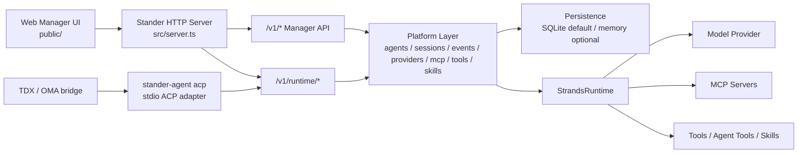

# Stander Agent

Stander Agent is a local managed-agent platform built around the Strands TypeScript SDK.
It provides a single HTTP service that hosts the Web manager, manager APIs, and an ACP-compatible runtime API used by `stander-agent acp`.

The current direction is:

```text
single agent app
  -> managed agents API
  -> session event runtime
  -> configurable tools and skills
  -> Strands runtime adapter
  -> persistence and sandbox implementations
```

## What It Provides

- Web manager UI served from the same process.
- Manager APIs under `/v1/*` for agents, sessions, events, providers, MCP servers, tools, skills, workflows, and multi-agent runs.
- Runtime APIs under `/v1/runtime/*` for ACP adapters.
- ACP stdio adapter via `stander-agent acp`.
- SQLite persistence by default, with in-memory mode for tests and local experiments.
- Strands-native execution through a runtime adapter, while keeping platform state in Stander manager sessions and event logs.

## Architecture



Important files:

```text
src/server.ts                         Unified HTTP server and manager API routing
src/server-cli.ts                     CLI entrypoint for the unified server
src/runtime-service/server.ts         Reusable /v1/runtime/* request handler
src/acp/stdio-server.ts               ACP JSON-RPC stdio server
src/acp/stander-runtime-client.ts     HTTP client used by the ACP adapter
src/platform/strands-runtime.ts       Strands runtime adapter
src/platform/persistence-factory.ts   SQLite/memory persistence selection
public/                               Web manager assets
```

## Runtime Model

There are two runtime session modes:

1. **Platform-backed mode**

   When `/v1/runtime/sessions` receives an `agentId`, Stander creates a real manager session.
   Prompts then use the selected manager agent configuration, including:

   - model ID
   - model provider
   - system prompt
   - MCP servers
   - tools
   - skills
   - agent tools
   - previous event context

   These sessions appear in the Web manager and write to the same session event log as browser-created sessions.

2. **Standalone compatibility mode**

   When no `agentId` is provided, Stander creates a standalone runtime session using the fallback model.
   This keeps simple ACP smoke tests and early integrations working.

## Requirements

- Node.js with native `fetch` support.
- npm.
- A configured model provider for real agent execution.

Install dependencies:

```bash
npm install
```

## Run the Unified Server

For development:

```bash
export STANDER_RUNTIME_TOKEN="<shared-runtime-token>"
export PORT=8787
npm run dev:runtime
```

`npm run dev:runtime` starts the unified service. It serves:

- Web manager: `http://127.0.0.1:8787/`
- Health check: `GET /health`
- Manager APIs: `/v1/*`
- Runtime APIs: `/v1/runtime/*`

`npm run dev:server` also starts the same unified server entrypoint.

For a deployment machine, use the service script:

```bash
chmod +x scripts/run.sh
STANDER_RUNTIME_TOKEN="<shared-runtime-token>" ./scripts/run.sh start
./scripts/run.sh status
./scripts/run.sh logs
```

The script supports `foreground`, `start`, `stop`, `restart`, `status`, and `logs`. It also loads an optional `.env` file from the project root.

## Environment Variables

Server-side:

```text
HOST                       Host to bind. Default: 0.0.0.0
PORT                       Port to bind. Default: 8787 for server-cli, 3000 in startStanderServer defaults
STANDER_RUNTIME_TOKEN      Bearer token required by /v1/runtime/*
STANDER_MODEL              Fallback model for standalone runtime sessions
STANDER_WORKSPACE_ROOT     Local workspace root for sandbox operations
PERSISTENCE_MODE           sqlite or memory. Default: sqlite
STANDER_DATA_DIR           Data directory. Default: .stander
STANDER_DB_PATH            SQLite database path
```

ACP adapter-side:

```text
STANDER_RUNTIME_URL        Base URL of the Stander server, for example http://runtime.internal:8787
STANDER_RUNTIME_TOKEN      Bearer token matching the server
STANDER_AGENT_ID           Optional manager agent id. Enables platform-backed runtime sessions
STANDER_SESSION_SOURCE     Optional source marker, for example tdx or acp
STANDER_MODEL              Fallback model for standalone runtime sessions
```

`STANDER_MODEL` is not the primary source of configuration for platform-backed sessions. When `STANDER_AGENT_ID` is set, the manager agent configuration wins.

## Use the Web Manager

Start the server and open:

```text
http://127.0.0.1:8787/
```

Typical flow:

1. Create or configure a model provider.
2. Create an agent.
3. Attach tools, skills, MCP servers, or agent tools as needed.
4. Create a session.
5. Send messages and inspect the event timeline.

## Use the ACP Adapter

The ACP adapter is a JSON-RPC stdio server:

```bash
STANDER_RUNTIME_URL="http://127.0.0.1:8787" \
STANDER_RUNTIME_TOKEN="<shared-runtime-token>" \
STANDER_AGENT_ID="<manager-agent-id>" \
STANDER_SESSION_SOURCE="acp" \
npm run dev:acp
```

Manual smoke test:

```bash
printf '{"jsonrpc":"2.0","id":1,"method":"initialize","params":{"protocolVersion":1}}\n{"jsonrpc":"2.0","id":2,"method":"session/new","params":{"cwd":"."}}\n' \
  | STANDER_RUNTIME_URL="http://127.0.0.1:8787" \
    STANDER_RUNTIME_TOKEN="<shared-runtime-token>" \
    STANDER_AGENT_ID="<manager-agent-id>" \
    STANDER_SESSION_SOURCE="acp" \
    npm run dev:acp
```

Expected result:

- `initialize` returns ACP protocol capabilities.
- `session/new` returns a Stander manager session ID when `STANDER_AGENT_ID` is set.
- The created session appears in the Web manager.

## TDX / OMA Runtime Integration

TDX / OMA can run `stander-agent acp` as an ACP-compatible local agent.

The ACP process must receive:

```text
STANDER_RUNTIME_URL
STANDER_RUNTIME_TOKEN
STANDER_AGENT_ID
STANDER_SESSION_SOURCE
```

In the current TDX bridge design, the selected ACP `agent_id` identifies the ACP wrapper, not the Stander manager agent.
Therefore, the Stander manager `agentId` must be provided through an explicit binding channel such as runtime/session environment variables.

Once this binding is present:

```text
TDX session
  -> oma bridge daemon
  -> stander-agent acp
  -> Stander /v1/runtime/*
  -> Stander manager session
  -> StrandsRuntime
  -> Stander event log and Web timeline
```

## Key HTTP APIs

Manager APIs:

```text
GET  /health
GET  /v1/platform/status
GET  /v1/model-providers
GET  /v1/mcp-servers
GET  /v1/agents
GET  /v1/tools
GET  /v1/skills
GET  /v1/sessions
POST /v1/sessions
GET  /v1/sessions/:id
POST /v1/sessions/:id/messages
GET  /v1/sessions/:id/events
GET  /v1/sessions/:id/events/stream
GET  /v1/workflows
GET  /v1/workflow-templates
POST /v1/multi-agent/graph/runs
POST /v1/multi-agent/swarm/runs
```

Runtime APIs:

```text
POST /v1/runtime/sessions
POST /v1/runtime/sessions/:id/prompt
POST /v1/runtime/sessions/:id/cancel
```

Runtime APIs require:

```text
Authorization: Bearer <STANDER_RUNTIME_TOKEN>
```

## Development Commands

```bash
npm run dev:server          # Start unified server from src/server-cli.ts
npm run dev:runtime         # Start unified server through stander-agent runtime path
npm run dev:acp             # Start ACP stdio adapter
npm run build               # TypeScript check
npm test                    # Full test suite and build
npm run test:acp
npm run test:runtime-service
npm run test:unified-server
```

## Verification

Run:

```bash
npm test
npm run build
```

Manual ACP verification:

1. Start Stander:

   ```bash
   STANDER_RUNTIME_TOKEN="<shared-runtime-token>" PORT=8787 npm run dev:runtime
   ```

2. Create an agent in the Web manager and copy its `agentId`.

3. Run ACP `initialize` and `session/new` with `STANDER_AGENT_ID`.

4. Confirm the session appears in the Web manager.

5. Send `session/prompt` and confirm the Web timeline receives `user.message`, status updates, and agent events.

## Persistence

By default, Stander uses SQLite:

```text
.stander/stander-agent.sqlite
```

Use in-memory persistence for tests or temporary runs:

```bash
PERSISTENCE_MODE=memory npm run dev:runtime
```

## Notes

- `config.json` is local-only. Commit `config.example.json` instead when examples are needed.
- Keep Strands SDK usage behind runtime adapters.
- Treat session events as the source of truth for future replay, trajectory, and UI state.
- Keep stores, sandboxing, and runtime boundaries behind interfaces.
