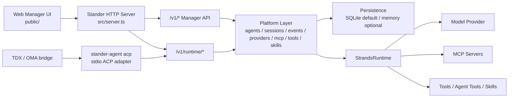

# Stander Agent

Stander Agent 是一个基于 Strands TypeScript SDK 的本地 managed-agent 平台。
它现在以单个 HTTP 服务同时提供 Web manager、manager API，以及供 `stander-agent acp` 调用的 ACP runtime API。

当前演进方向：

```text
single agent app
  -> managed agents API
  -> session event runtime
  -> configurable tools and skills
  -> Strands runtime adapter
  -> persistence and sandbox implementations
```

## 提供什么

- 同进程托管 Web manager UI。
- `/v1/*` manager API：agents、sessions、events、providers、MCP servers、tools、skills、workflows、multi-agent runs。
- `/v1/runtime/*` runtime API：供 ACP adapter 调用。
- `stander-agent acp`：ACP stdio adapter。
- 默认 SQLite 持久化，也支持 memory 模式。
- 执行层保持 Strands-native，但平台状态以 Stander manager session 和 event log 为主。

## 架构



重要文件：

```text
src/server.ts                         统一 HTTP server 和 manager API 路由
src/server-cli.ts                     统一 server 的 CLI 入口
src/runtime-service/server.ts         可复用的 /v1/runtime/* request handler
src/acp/stdio-server.ts               ACP JSON-RPC stdio server
src/acp/stander-runtime-client.ts     ACP adapter 使用的 HTTP client
src/platform/strands-runtime.ts       Strands runtime adapter
src/platform/persistence-factory.ts   SQLite/memory 持久化选择
public/                               Web manager 静态资源
```

## Runtime 模式

当前 runtime session 有两种模式：

1. **Platform-backed mode**

   当 `/v1/runtime/sessions` 收到 `agentId` 时，Stander 会创建一个真正的 manager session。
   后续 prompt 会使用这个 manager agent 的配置，包括：

   - model ID
   - model provider
   - system prompt
   - MCP servers
   - tools
   - skills
   - agent tools
   - 历史事件上下文

   这种 session 会出现在 Web manager 中，并写入与浏览器创建 session 相同的 event log。

2. **Standalone compatibility mode**

   当没有传 `agentId` 时，Stander 会创建一个 standalone runtime session，并使用 fallback model。
   这是为了保留简单 ACP smoke test 和早期集成的兼容性。

## 环境要求

- 支持原生 `fetch` 的 Node.js。
- npm。
- 如果要真实执行 agent，需要配置可用的 model provider。

安装依赖：

```bash
npm install
```

## 启动统一服务

开发环境：

```bash
export STANDER_RUNTIME_TOKEN="<shared-runtime-token>"
export PORT=8787
npm run dev:runtime
```

`npm run dev:runtime` 会启动统一服务，提供：

- Web manager：`http://127.0.0.1:8787/`
- 健康检查：`GET /health`
- Manager APIs：`/v1/*`
- Runtime APIs：`/v1/runtime/*`

`npm run dev:server` 也会启动同一个统一 server 入口。

部署机器可以使用服务脚本：

```bash
chmod +x scripts/run.sh
STANDER_RUNTIME_TOKEN="<shared-runtime-token>" ./scripts/run.sh start
./scripts/run.sh status
./scripts/run.sh logs
```

脚本支持 `foreground`、`start`、`stop`、`restart`、`status` 和 `logs`，并会自动加载项目根目录下可选的 `.env` 文件。
如果交互执行 `start`、`restart` 或 `foreground` 时没有设置 `STANDER_RUNTIME_TOKEN`，脚本会以不回显的方式提示用户输入，并保存到权限为 `600` 的 `.env` 文件中。

## 环境变量

Server 侧：

```text
HOST                       绑定 host。默认：0.0.0.0
PORT                       绑定端口。server-cli 默认 8787，startStanderServer 默认 3000
STANDER_RUNTIME_TOKEN      /v1/runtime/* 需要的 Bearer token
STANDER_MODEL              standalone runtime session 的 fallback model
STANDER_WORKSPACE_ROOT     本地 sandbox workspace root
PERSISTENCE_MODE           sqlite 或 memory。默认：sqlite
STANDER_DATA_DIR           数据目录。默认：.stander
STANDER_DB_PATH            SQLite 数据库路径
```

ACP adapter 侧：

```text
STANDER_RUNTIME_URL        Stander server 地址，例如 http://runtime.internal:8787
STANDER_RUNTIME_TOKEN      与 server 匹配的 Bearer token
STANDER_AGENT_ID           可选的 manager agent id。设置后启用 platform-backed runtime session
STANDER_SESSION_SOURCE     可选来源标记，例如 tdx 或 acp
STANDER_MODEL              standalone runtime session 的 fallback model
```

`STANDER_MODEL` 不是 platform-backed session 的主要配置来源。设置 `STANDER_AGENT_ID` 后，以 manager agent 配置为准。

## 使用 Web Manager

启动 server 后打开：

```text
http://127.0.0.1:8787/
```

典型流程：

1. 创建或配置 model provider。
2. 创建 agent。
3. 按需绑定 tools、skills、MCP servers 或 agent tools。
4. 创建 session。
5. 发送消息并查看 event timeline。

## 使用 ACP Adapter

ACP adapter 是一个 JSON-RPC stdio server：

```bash
STANDER_RUNTIME_URL="http://127.0.0.1:8787" \
STANDER_RUNTIME_TOKEN="<shared-runtime-token>" \
STANDER_AGENT_ID="<manager-agent-id>" \
STANDER_SESSION_SOURCE="acp" \
npm run dev:acp
```

手动 smoke test：

```bash
printf '{"jsonrpc":"2.0","id":1,"method":"initialize","params":{"protocolVersion":1}}\n{"jsonrpc":"2.0","id":2,"method":"session/new","params":{"cwd":"."}}\n' \
  | STANDER_RUNTIME_URL="http://127.0.0.1:8787" \
    STANDER_RUNTIME_TOKEN="<shared-runtime-token>" \
    STANDER_AGENT_ID="<manager-agent-id>" \
    STANDER_SESSION_SOURCE="acp" \
    npm run dev:acp
```

预期结果：

- `initialize` 返回 ACP protocol capabilities。
- 设置 `STANDER_AGENT_ID` 后，`session/new` 返回 Stander manager session ID。
- 创建出的 session 能在 Web manager 看到。

## TDX / OMA Runtime 接入

TDX / OMA 可以把 `stander-agent acp` 当作 ACP-compatible local agent 来运行。

ACP 进程需要拿到：

```text
STANDER_RUNTIME_URL
STANDER_RUNTIME_TOKEN
STANDER_AGENT_ID
STANDER_SESSION_SOURCE
```

在当前 TDX bridge 设计里，选中的 ACP `agent_id` 表示 ACP wrapper id，不是 Stander manager agent id。
因此，Stander manager 的 `agentId` 需要通过明确的绑定通道提供，例如 runtime/session 环境变量。

绑定存在后，调用链路是：

```text
TDX session
  -> oma bridge daemon
  -> stander-agent acp
  -> Stander /v1/runtime/*
  -> Stander manager session
  -> StrandsRuntime
  -> Stander event log and Web timeline
```

## 关键 HTTP APIs

Manager APIs：

```text
GET  /health
GET  /v1/platform/status
GET  /v1/model-providers
GET  /v1/mcp-servers
GET  /v1/agents
GET  /v1/tools
GET  /v1/skills
GET  /v1/sessions
POST /v1/sessions
GET  /v1/sessions/:id
POST /v1/sessions/:id/messages
GET  /v1/sessions/:id/events
GET  /v1/sessions/:id/events/stream
GET  /v1/workflows
GET  /v1/workflow-templates
POST /v1/multi-agent/graph/runs
POST /v1/multi-agent/swarm/runs
```

Runtime APIs：

```text
POST /v1/runtime/sessions
POST /v1/runtime/sessions/:id/prompt
POST /v1/runtime/sessions/:id/cancel
```

Runtime APIs 需要：

```text
Authorization: Bearer <STANDER_RUNTIME_TOKEN>
```

## 开发命令

```bash
npm run dev:server          # 从 src/server-cli.ts 启动统一 server
npm run dev:runtime         # 通过 stander-agent runtime 路径启动统一 server
npm run dev:acp             # 启动 ACP stdio adapter
npm run build               # TypeScript 检查
npm test                    # 完整测试和 build
npm run test:acp
npm run test:runtime-service
npm run test:unified-server
```

## 验证

运行：

```bash
npm test
npm run build
```

手动 ACP 验证：

1. 启动 Stander：

   ```bash
   STANDER_RUNTIME_TOKEN="<shared-runtime-token>" PORT=8787 npm run dev:runtime
   ```

2. 在 Web manager 创建 agent，并复制它的 `agentId`。

3. 带上 `STANDER_AGENT_ID` 执行 ACP `initialize` 和 `session/new`。

4. 确认 session 出现在 Web manager 中。

5. 发送 `session/prompt`，确认 Web timeline 收到 `user.message`、状态更新和 agent 事件。

## 持久化

默认使用 SQLite：

```text
.stander/stander-agent.sqlite
```

临时运行或测试可以使用 memory 模式：

```bash
PERSISTENCE_MODE=memory npm run dev:runtime
```

## 说明

- `config.json` 只用于本地，不要提交；需要示例时提交 `config.example.json`。
- Strands SDK 的使用应保持在 runtime adapter 后面。
- session events 是未来 replay、trajectory、UI state 的事实来源。
- stores、sandbox 和 runtime 边界应保持接口化。
